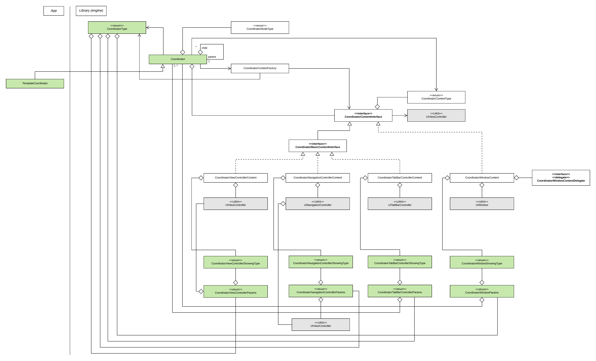
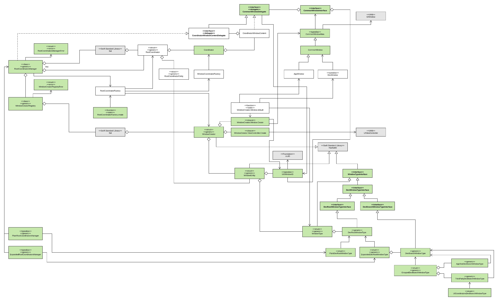
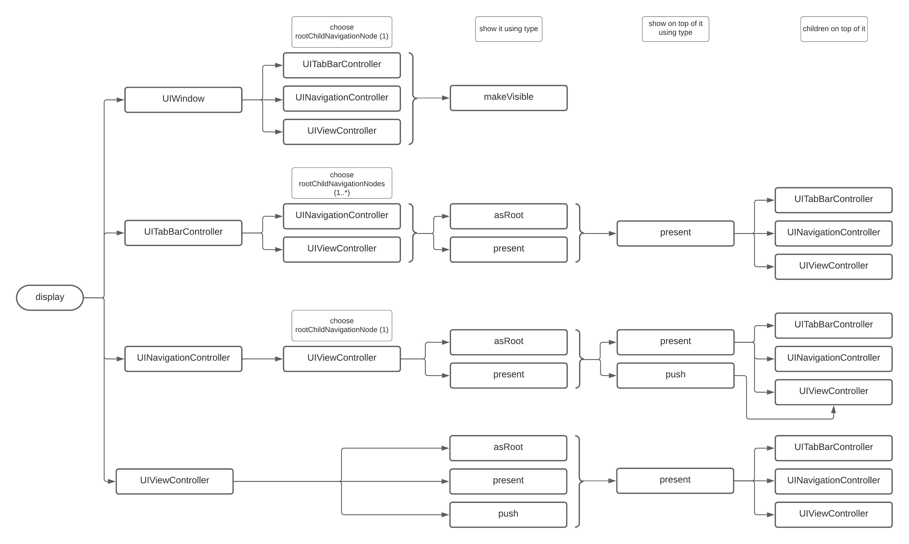
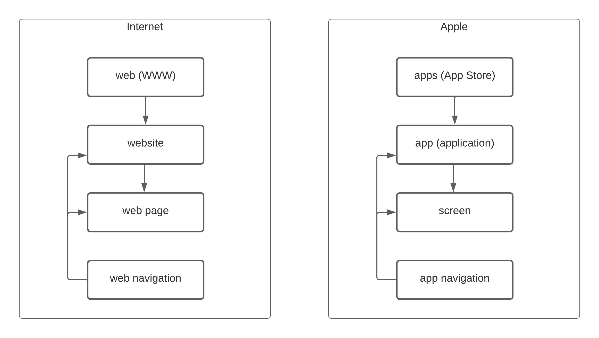
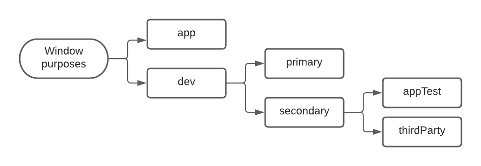

# AppNavigation

## UML diagrams

### Coordinator-based navigation architecture

### UIWindow-based navigation architecture

### Display navigation layers

### High-level navigation layers

### UIWindow exemplary purposes

